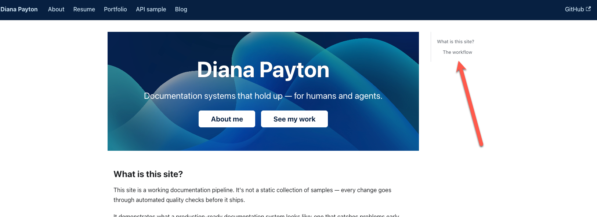

Today I had an object lesson in why I need to supervise my workflow.

{/* truncate */}

I've been making updates around the site, as one does, and realized that Vale wasn't running on my home page or portfolio site. I inquired of Claude Code as to why, and it said that those pages were .tsx files, which Vale ignores.

Mind you, I hadn't asked it to make them .tsx files. It just did it. So I asked if there was any reason they shouldn't be .mdx files. It said there wasn't, so I had it change them to .mdx.

No biggie, right?

Well, today I checked the home page again, and lo and behold, there was a new sidebar on it. Grr.

